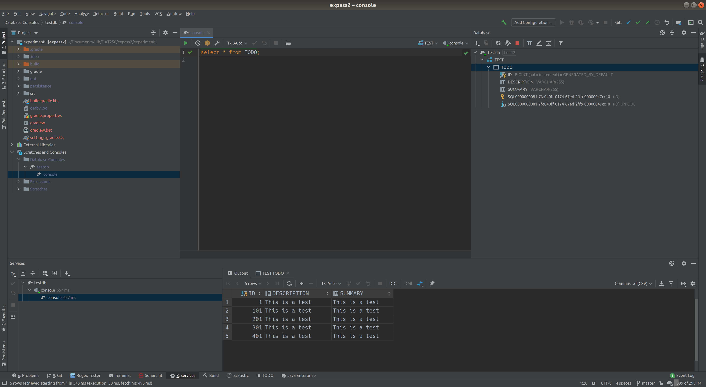

# DAT250 Experiment Assignment 2

## Installation of JPA

Installation of derby was straight forward until I wanted to use the embedded database viewer in IntelliJ. It refused to recognize the installed derby driver until I manually added each `jar` and `war` found at `$DERBY_INSTALL/lib`.

## Experiment 1

The first experiment can be found under the folder [experiment1](./experiment1)

## Experiment 2

The second experiment can be found under the folder [experiment2](./experiment2)

## Database inspection

I used IntelliJ's built in database tool to inspect the database. It displays existing tables and allows for arbitrary queries to be done to the database.

## Issues

There are no pending issues with this assignment that has not been resolved.
