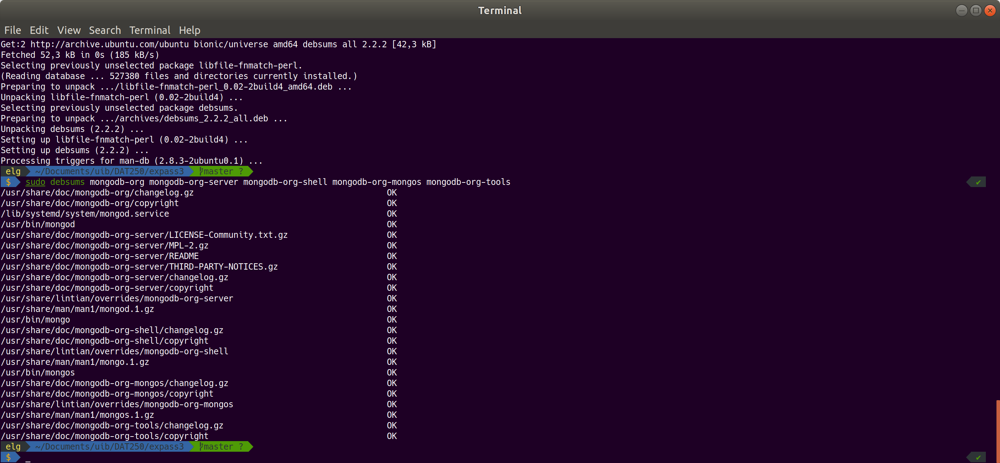
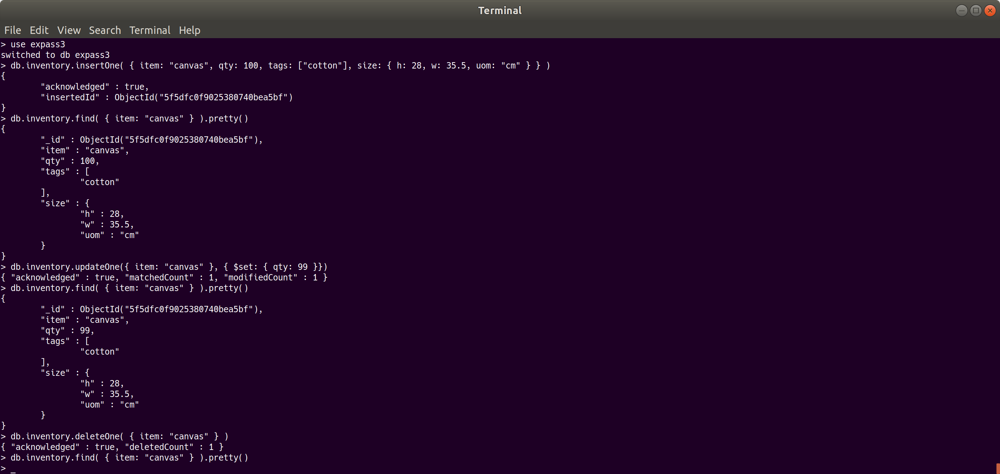
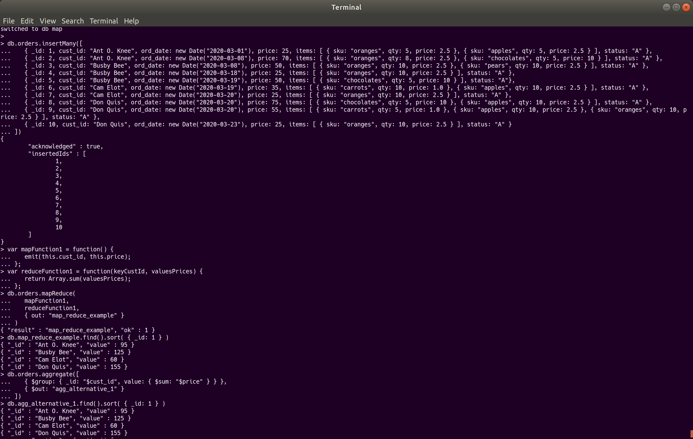
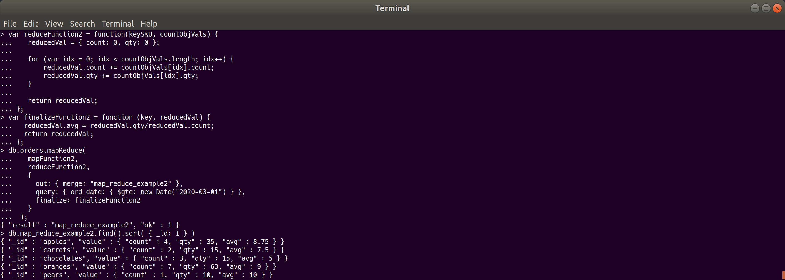
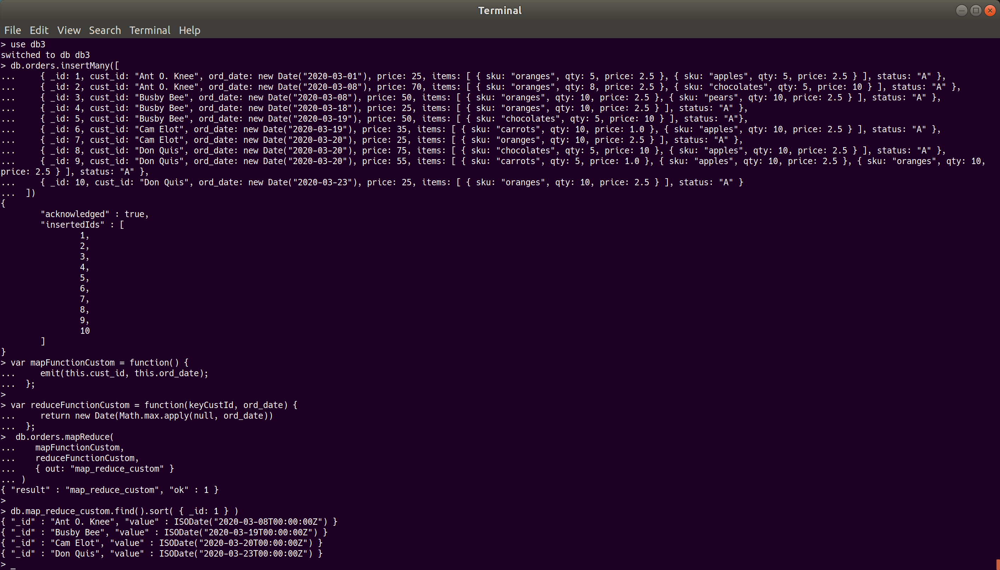

# DAT250 Experiment Assignment 3

## MongoDB installation verification

As mongodb is installed on my ubuntu system via `apt` verification is not really a problem, however to please the grading Gods I used [debsums](https://manpages.ubuntu.com/manpages/trusty/man1/debsums.1.html) to verify the `md5` sums of the mongodb packages.

## Experiment 1

## Experiment 2

### Custom map reduce function

Source for this function can be found in [custom-mongodb-map-reduce.js](custom-mongodb-map-reduce.js)

## Usefulness of custom function

The custom function tells us when the last order was made, so we might remind them that we exist so they order from us even more.

## Issues

There are no pending issues with this assignment that has not been resolved.
