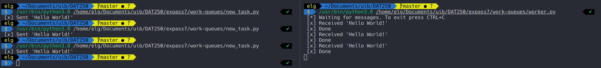
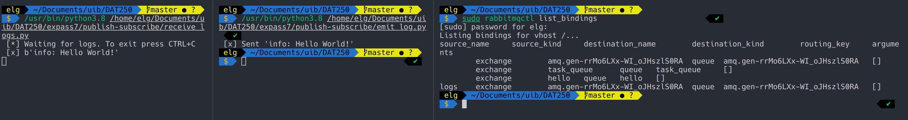

# DAT250 Experiment Assignment 7

## Technical problems

See [issues](#issues)

## Experiment 1

There is no code when installing with apt so here is a command history dump

```bash
curl -fsSL https://github.com/rabbitmq/signing-keys/releases/download/2.0/rabbitmq-release-signing-key.asc | sudo apt-key add -
  410  sudo apt-key adv --keyserver "hkps://keys.openpgp.org" --recv-keys "0x0A9AF2115F4687BD29803A206B73A36E6026DFCA"
  411  deb https://dl.bintray.com/rabbitmq-erlang/debian $distribution $component
  412  sudo apt-get install apt-transport-https
  413  deb https://dl.bintray.com/rabbitmq-erlang/debian bionic 23.x
  414  sudo apt install deb
  415  snap install deb
  416  vi /etc/apt/sources.list.d/bintray.erlang.list
  418  sudo apt-get update -y
  419  sudo vi /etc/apt/sources.list.d/bintray.erlang.list
  420  update
  421  sudo apt-get install -y erlang-base erlang-asn1 erlang-crypto erlang-eldap erlang-ftp erlang-inets erlang-mnesia erlang-os-mon erlang-parsetools erlang-public-key erlang-runtime-tools erlang-snmp erlang-ssl erlang-syntax-tools erlang-tftp erlang-tools erlang-xmerl
  422  code /etc/apt/preferences.d/erlang
  423  sudo code /etc/apt/preferences.d/erlang
  424  sudo vi /etc/apt/preferences.d/erlang
  425  sudo apt-cache policy
  426  \nwget -O - "https://packagecloud.io/rabbitmq/rabbitmq-server/gpgkey" | sudo apt-key add -
  427  sudo --
  428  su --
  429  sudo -i
  131  zsh
  132  #!/bin/sh
  133  ## If sudo is not available on the system,
  134  ## uncomment the line below to install it
  135  # apt-get install -y sudo
  136  sudo apt-get update -y
  137  ## Install prerequisites
  138  sudo apt-get install curl gnupg -y
  139  ## Install RabbitMQ signing key
  140  curl -fsSL https://github.com/rabbitmq/signing-keys/releases/download/2.0/rabbitmq-release-signing-key.asc | sudo apt-key add -
  141  ## Install apt HTTPS transport
  142  sudo apt-get install apt-transport-https
  143  ## Add Bintray repositories that provision latest RabbitMQ and Erlang 23.x releases
  144  sudo tee /etc/apt/sources.list.d/bintray.rabbitmq.list <<EOF
## Installs the latest Erlang 23.x release.
## Change component to "erlang-22.x" to install the latest 22.x version.
## "bionic" as distribution name should work for any later Ubuntu or Debian release.
## See the release to distribution mapping table in RabbitMQ doc guides to learn more.
deb https://dl.bintray.com/rabbitmq-erlang/debian bionic erlang
## Installs latest RabbitMQ release
deb https://dl.bintray.com/rabbitmq/debian bionic main
EOF

  145  ## Update package indices
  146  sudo apt-get update -y
  147  ## Install rabbitmq-server and its dependencies
  148  sudo apt-get install rabbitmq-server -y --fix-missing
  149  sudo apt-get install -y rabbitmq-server
  150  more |history
  430  history
```

## Experiment 2

See [hello-world](hello-world)


## Experiment 3

See [work-queues](work-queues)



## Experiment 4

See [publish-subscribe](publish-subscribe)



## Issues

There are no pending issues with this assignment that has not been resolved.
